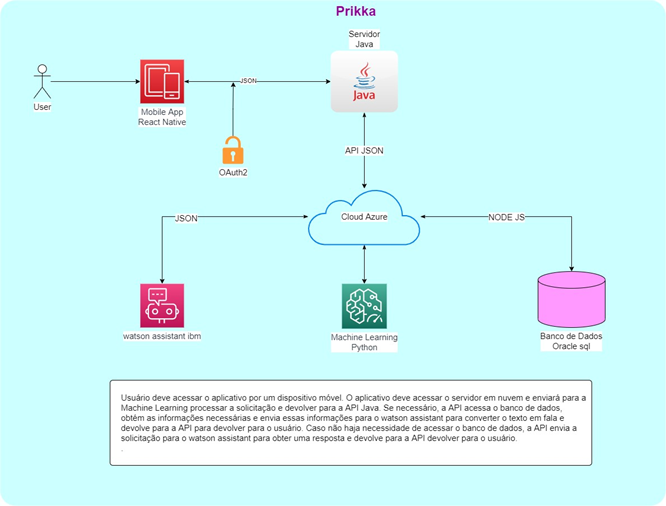

# Sprint4_Digital
Entrega da Sprint 4 referente a matéria de Digital Business Enablement do Professor João Carlos Lima e Silva

---------------------------------------------------------------------------------------------------------------------------------------------------- 

# Projeto: Assistente Virtual "Sexta-Feira"
 - Gabriel Sun Gonçalo da Silva                **RM: 88316**
 - Kleber Albert de Sousa Monteiro             **RM: 88711**
 - Renato Miranda Esmail                      **RM: 86701**

----------------------------------------------------------------------------------------------------------------------------------------------- 

# Link do vídeo e App
- [Link vídeo Youtube]()

- [App Prikka](https://snack.expo.dev/@renatchos/prikka-app)

---------------------------------------------------------------------------------------------------------------------------------------------------- 

# Introducao
- Restaurantes pagam altas taxas para poderem vender por aplicativos de terceiros e lidam com muita concorrência. 

- Estamos oferecendo um aplicativo exclusivo para o restaurante reduzir custos e ficar livre de concorrentes.

# Arquitetura

---------------------------------------------------------------------------------------------------------------------------------------------------- 

# Conclusão
- Nossa equipe ao longo do projeto foi diminuindo por conta da saída de alguns membros, devido a isto tivemos dificuldades para dar conta do projeto com o time reduzido.
- Por conta dessa dificuldade, acertamos em estarmos sempre comunicando o andamento do projeto para cada integrante e nos ajudarmos na deficiência de cada um.

- Tivemos dificuldades e não conseguimos realizar a integração de voz diretamento no aplicativo e por conta disso optamos por levar utilizar 
o telegram para a a integração de voz

- Para melhorias futuras pretendemos estudar melhor como funcionaria a integração de voz para ser implementada no app e também integrar o aplicativo com 
banco de dados.

